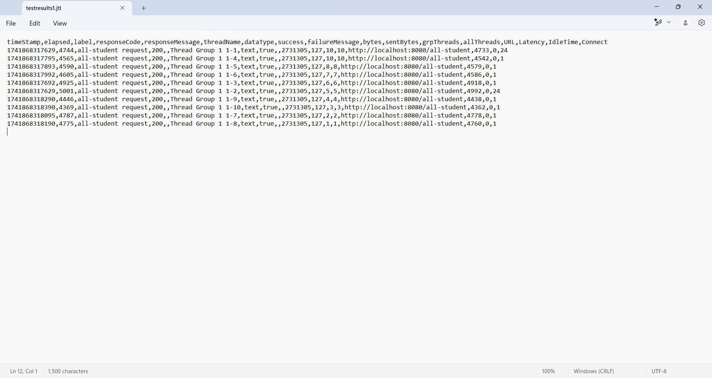
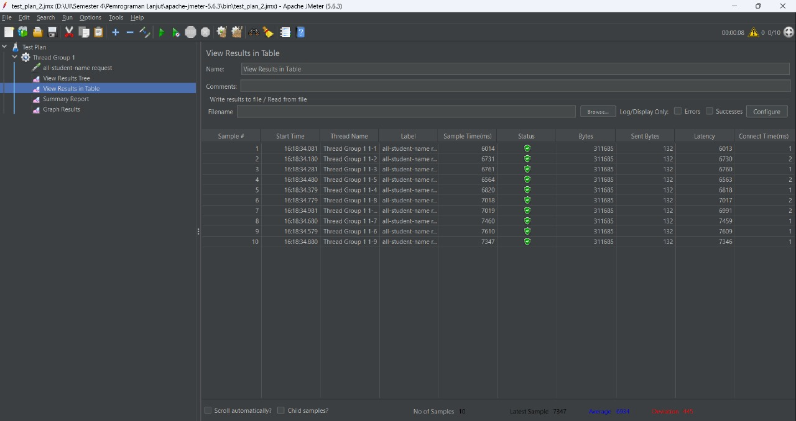
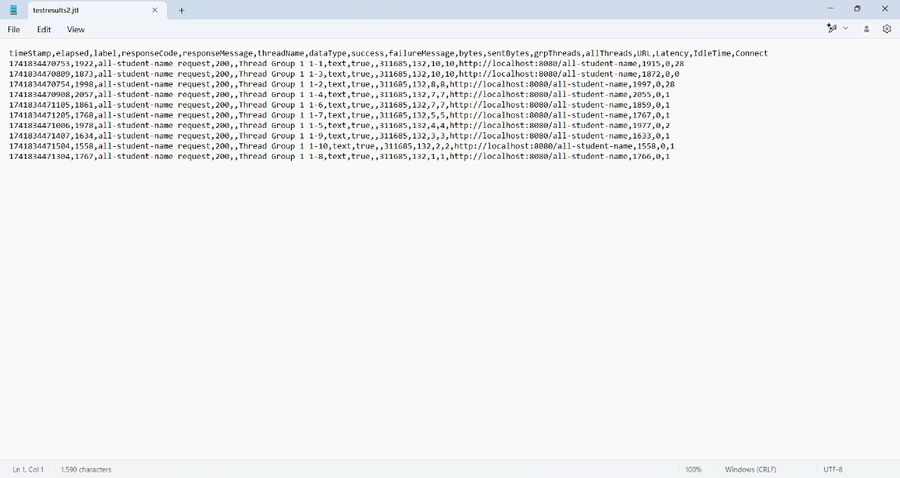
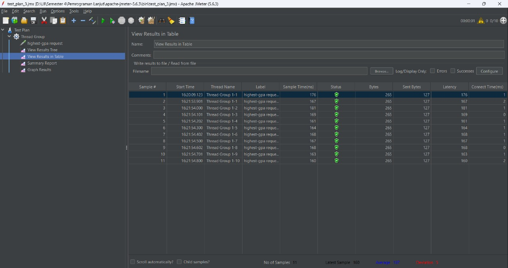
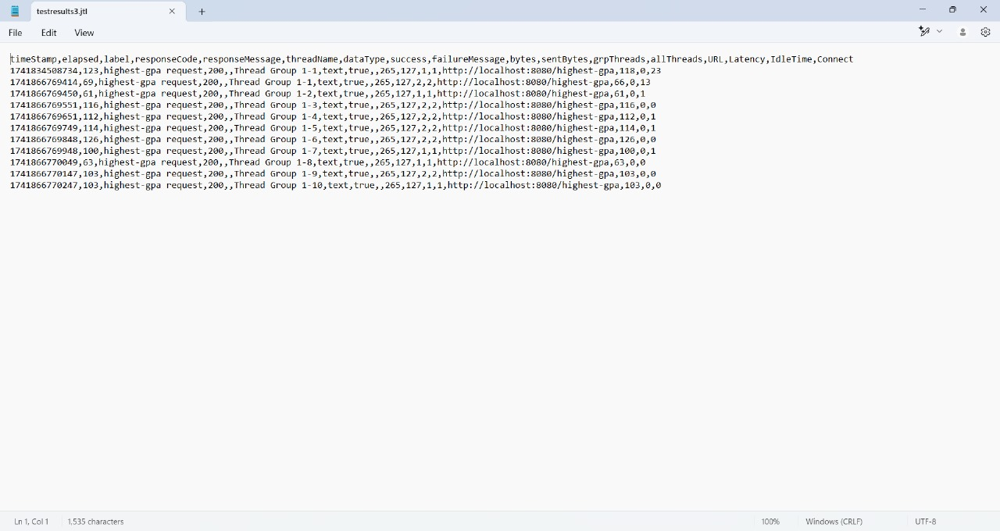
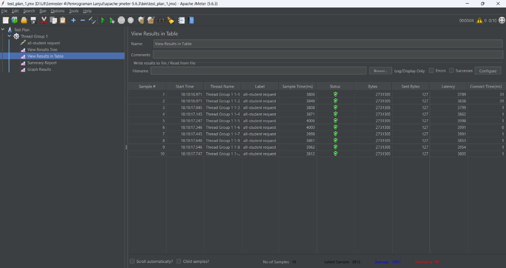
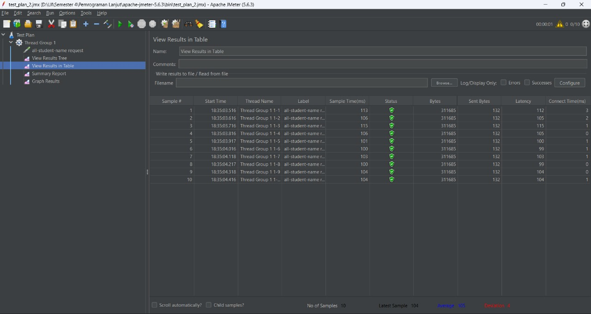
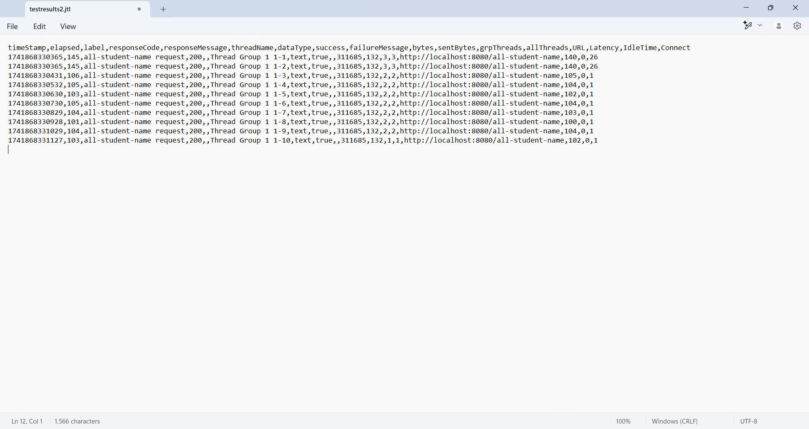
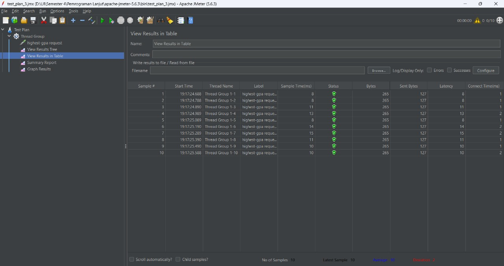
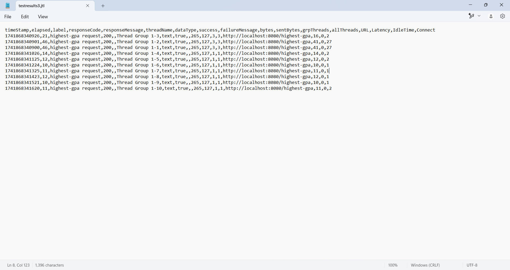

# Reflection of Advanced Programming
### Name: Shane Michael Tanata Tendy
### NPM: 2306259976
### Class: B

----

## Pre-Profiling and Optimization Tests ##

1. `test_plan_1.jmx`: `/all-student` endpoint
    - pre-optimize: test plan 1 (GUI)
    

    - pre-optimize: test plan 1 (Log File)
    

2. `test_plan_2.jmx`: `/all-student-name` endpoint
    - pre-optimize: test plan 2 (GUI)
    

    - pre-optimize: test plan 2 (Log File)
    

3. `test_plan_3.jmx`: `/highest-gpa` endpoint
    - pre-optimize: test plan 3 (GUI)
    

    - pre-optimize: test plan 3 (Log File)
    

## Post-Profiling and Optimization Tests ##

1. `test_plan_1.jmx`: `/all-student` endpoint
    - post-optimize: test plan 1 (GUI)
    

    - post-optimize: test plan 1 (Log File)
    

2. `test_plan_2.jmx`: `/all-student-name` endpoint
    - post-optimize: test plan 2 (GUI)
    

    - post-optimize: test plan 2 (Log File)
    

3. `test_plan_3.jmx`: `/highest-gpa` endpoint
    - post-optimize: test plan 3 (GUI)
    

    - post-optimize: test plan 3 (Log File)
    

## Summary ##

Data shown indicates there is a huge gap in terms of execution time between pre-profiling and post-profiling, which can be seen below:
1.  `/all-student` endpoint
    - `Before profiling`: `93,000 - 94,000 ms`
    - `After profiling`: `3,800 - 4,000 ms`
    - Effect: `95%` reduction in execution time (from `~93,500 ms` to `~3,900 ms`)

    Note: there is a huge gap between the log file and the GUI for `Before Profiling`, I believe that it is because I have pre-run the code first, hence reducing the amount of time needed for the tests. For this summary, I use the same source - GUI.

2. `/all-student-names` endpoint
    - `Before profiling`: `6,000 - 7,500 ms`
    - `After profiling`: `100 - 115 ms`
    - Effect: `98%` reduction in execution time (from `~6,750 ms` to `~107 ms`)

3. `/highest-gpa` endpoint
    - `Before profiling`: `160 - 180 ms`
    - `After profiling`: `8 - 15 ms`
    - Effect: `92%` reduction in execution time (from `~170 ms` to `~11 ms`)

Conclusion: Performance profiling helped us make our app way faster by fixing how we get and handle data. Looking at the numbers, we cut down loading times by over 90% for all our endpoints. The biggest improvement was for the student names page, which went from taking 6-7 seconds to load to just about a tenth of a second! By using profiling tools to find exactly where our code was running slowly, we could make smart fixes to our database queries and how we process data. This shows how important it is to measure performance and make targeted improvements rather than just guessing where problems might be.

## Reflection Question and Answer ##

### What is the difference between the approach of performance testing with JMeter and profiling with IntelliJ Profiler in the context of optimizing application performance? ###

JMeter and IntelliJ Profiler approach performance from completely different angles. It simulates actual users hitting your application and measures the overall experience. IntelliJ Profiler, on the other hand, is analyzing what each part of the engine is doing. It lets you see exactly which methods in your code are running slowly or consuming too much memory.

### How does the profiling process help you in identifying and understanding the weak points in your application? ###

Profiling is incredibly useful for pinpointing trouble areas in your code. It's like having X-ray vision, suddenly you can see which methods are eating up CPU time or allocating tons of memory. You might discover that a seemingly innocent method is called thousands of times, or that your application is spending 80% of its time in one small part of the code.

The call trees are particularly revealing, they show you the exact path of execution and how much time is spent in each method. Often, the real problems aren't where you expect them to be.

### Do you think IntelliJ Profiler is effective in assisting you to analyze and identify bottlenecks in your application code? ###

In my experience, IntelliJ Profiler is quite good at what it does. The biggest advantage is that it's integrated with my development environment, I can profile my code and then immediately jump to the problematic methods to fix them. The visual tools like flame graphs make it much easier to understand complex performance data, and being able to switch between CPU, memory, and thread profiling gives me a complete picture of what's happening.

### What are the main challenges you face when conducting performance testing and profiling, and how do you overcome these challenges? ###

The trickiest part of performance work is dealing with the observer effect, in which the act of profiling can itself change how your application behaves. I've found that using sampling profilers rather than instrumentation helps minimize this. Another challenge is recreating realistic conditions. Your application might behave very differently under actual load than it does with a single user in a development environment.

### What are the main benefits you gain from using IntelliJ Profiler for profiling your application code? ###

Integrating the profiler directly in IntelliJ makes finding and fixing performance issues much easier. When you see a slow method in the profiler, you can click it and jump straight to that code without having to switch between different programs. The graphs and charts are super helpful too, they turn complicated performance data into pictures that make it easier to spot problems. Being able to save your profiling results and compare them later is also really useful, because you can actually see if your fixes made things better or worse. This makes the whole process of improving your code's speed much more straightforward.

### How do you handle situations where the results from profiling with IntelliJ Profiler are not entirely consistent with findings from performance testing using JMeter? ###

It's pretty common to see different results between JMeter and profiler. JMeter is testing the entire system including network, database, and other services, while the profiler is focused just on application code. When I see inconsistencies, I usually try to narrow down the scope. Is the issue only appearing under heavy load? Sometimes you need to add logging at strategic points to understand what's happening when the system is under real pressure.

### What strategies do you implement in optimizing application code after analyzing results from performance testing and profiling? How do you ensure the changes you make do not affect the application's functionality? ###

When optimizing, I focus on the the methods that are using the most resources. To avoid breaking things, I rely heavily on automated tests. Make a change, run the tests, verify performance has improved, then move on. 
